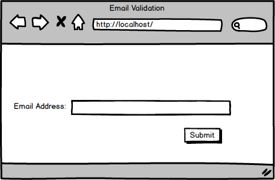
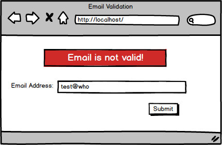
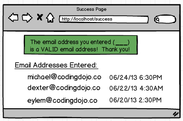

# Email Validation With DB

Create an application that asks a user to enter an email address and validates whether that email exists within the database.

## index.html
A simple form for the user to submit an email.

## Error
If the email address is not valid, have a notification "Email is not valid!" to display on the homepage.

## success.html
Once a valid email address is entered, save to the database the email address the user entered. On the success page, display all the email addresses entered along with the date and the time (e.g. June 24th, 2013, 6:00 PM) when the email addresses were entered

